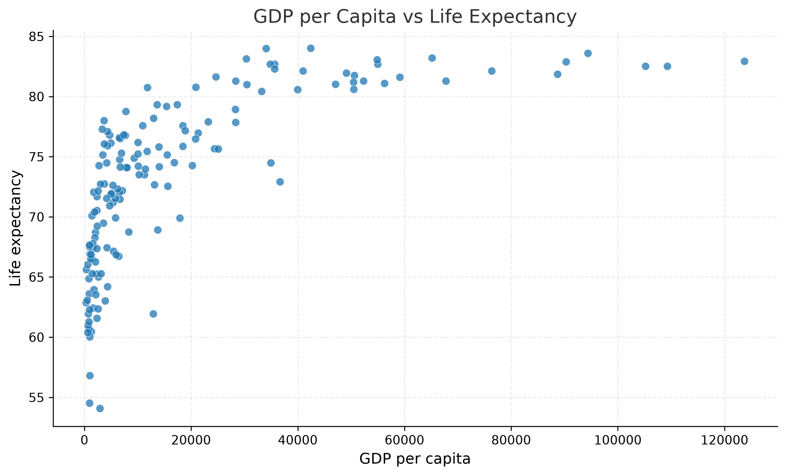
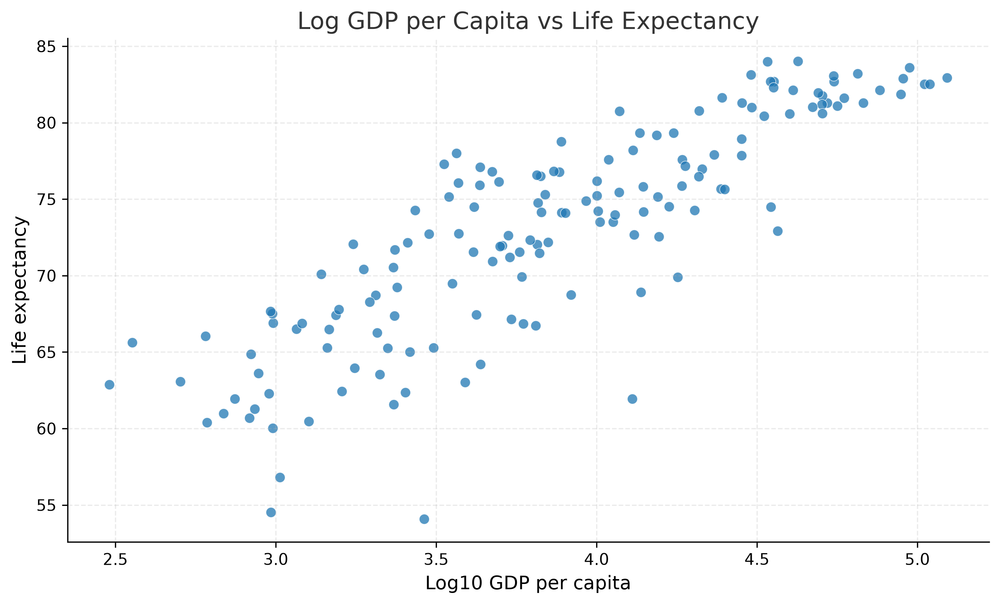
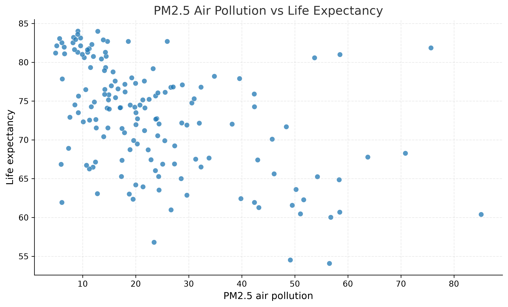
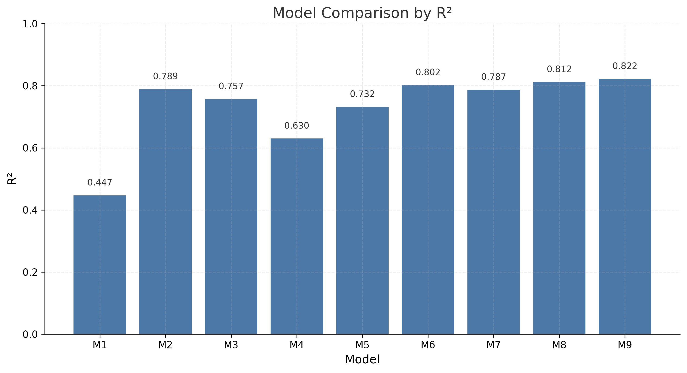
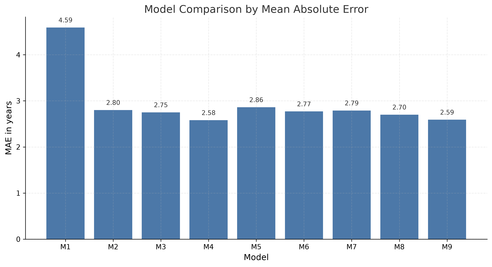
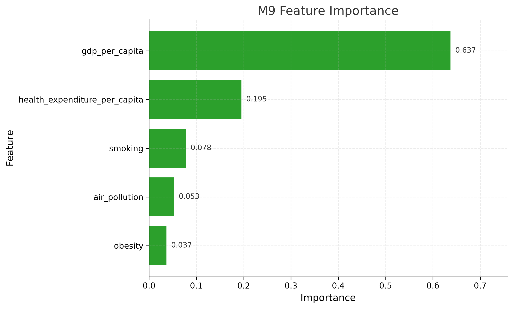

# What Makes a Society Healthy?

## A Machine Learning Analysis of Life Expectancy Across Countries

**Author:** Francesco Serra  
**Project Type:** Data Science / Machine Learning Project  
**Tools:** Python, pandas, scikit-learn, matplotlib, World Bank Data  

---

## Executive Summary

This report investigates the determinants of life expectancy across countries using international public datasets and machine learning models.

The analysis compares economic, healthcare, lifestyle, environmental and social variables to evaluate which factors best explain cross-country differences in life expectancy.

The final selected model is **M9 — Absolute Healthcare & Environment Random Forest**, which combines GDP per capita, health expenditure per capita, obesity prevalence, smoking prevalence and PM2.5 air pollution.

The model achieves:

- **R² = 0.822**
- **Mean Absolute Error = 2.59 years**
- **Observations = 155**

The results show that GDP per capita remains the strongest predictor of life expectancy, but the model improves when healthcare spending, lifestyle risks and environmental exposure are added.

Health expenditure per capita is more informative than healthcare spending as a percentage of GDP, while smoking prevalence is the most informative lifestyle variable. Education appears to be a promising social determinant, but it is not included in the final model because of limited data coverage.

Overall, the project suggests that life expectancy is best understood as a multidimensional outcome. Economic development matters most, but healthcare capacity, behavioral risks, environmental exposure and social development also contribute to explaining why people live longer in some countries than in others.

---

## 1. Introduction

Life expectancy is one of the most important indicators of a society’s overall well-being. It reflects not only the quality of healthcare systems, but also broader economic, social, behavioral and environmental conditions.

Countries with higher life expectancy often benefit from stronger economies, better healthcare access, healthier living conditions, safer environments and higher levels of social development. However, these factors do not operate independently. Economic development may support better healthcare systems, while education may influence health behaviors, and environmental exposure may affect long-term health outcomes.

For this reason, life expectancy should not be analyzed as the result of a single factor. A multidimensional approach is needed to understand how different categories of variables contribute to cross-country differences in longevity.

This project uses machine learning methods to analyze the relationship between life expectancy and several explanatory variables across countries. The goal is not only to build a predictive model, but also to understand which macro-categories of variables are most informative.

---

## 2. Research Question and Project Objective

The central research question is:

> **Which economic, healthcare, lifestyle, environmental and social factors best explain differences in life expectancy across countries?**

The objective of the project is to compare different groups of explanatory variables and evaluate how they contribute to the prediction of life expectancy.

The analysis focuses on five macro-categories:

1. **Economic factors**
2. **Healthcare factors**
3. **Lifestyle factors**
4. **Environmental factors**
5. **Social factors**

The project starts from simple baseline models and progressively adds new categories of variables. This allows the analysis to evaluate whether each additional dimension improves the understanding of life expectancy across countries.

The project is therefore both predictive and interpretative. It aims to identify a strong final model, but also to understand what the model suggests about the broader determinants of longevity.

---

## 3. Project Documentation and Reproducibility

The project is documented through two main notebooks and this final written report.

The **working notebook** preserves the full exploratory workflow, including intermediate tests, data cleaning decisions, model experiments, validation checks and earlier attempts. It is intentionally more detailed and less polished because it documents the complete development process.

The **final analysis notebook** presents the cleaned and structured version of the project. It focuses on the most important stages of the analysis, including data quality checks, exploratory analysis, model comparison, feature importance and final interpretation.

This report summarizes the methodology and results in a more narrative format. It does not reproduce every code cell, but it is based on the datasets, audit tables, figures and conclusions generated in the notebooks.

This structure allows the project to remain both transparent and readable:

- the working notebook documents the complete process;
- the final notebook presents the main technical workflow;
- the report provides the final interpretation and communication of results.

---

## 4. Data Sources and Variable Framework

The project uses country-level international data from public sources, mainly World Bank indicators and World Bank Data360 health-related data.

The target variable is **life expectancy at birth**.

The explanatory variables are organized as follows:

| Macro-category | Variable |
|---|---|
| Target | Life expectancy |
| Economic | GDP per capita |
| Healthcare | Health expenditure as % of GDP |
| Healthcare | Health expenditure per capita |
| Lifestyle | Obesity prevalence |
| Lifestyle | Smoking prevalence |
| Environmental | PM2.5 air pollution |
| Social | Education |

Most variables refer to 2022. However, PM2.5 air pollution data were not available for 2022 in the selected indicator. Therefore, 2020 PM2.5 exposure was used as the most recent available environmental proxy with broad country coverage.

The final model dataset includes 155 observations and contains no missing values across the selected predictors.

A specific methodological note concerns obesity prevalence. In this project, obesity is measured using a standard BMI-based definition: the percentage of adults with a body mass index of **30 kg/m² or higher**. This is a widely used population-level indicator and is appropriate for international comparison, but BMI does not directly measure body fat and does not distinguish between fat mass, muscle mass and bone mass. Therefore, obesity prevalence should be interpreted as an approximate population-level indicator rather than a perfect measure of unhealthy body composition.

---

## 5. Data Cleaning and Preparation

The data preparation process involved merging multiple country-level datasets by country code and selecting the most recent available values for each variable.

The cleaning process included:

- selecting relevant variables;
- harmonizing country identifiers;
- filtering observations by year;
- checking missing values;
- removing incomplete observations model by model;
- checking for potential World Bank aggregate groups;
- validating the final model dataset.

The final model dataset used for M9 contains:

| Check | Result |
|---|---:|
| Observations | 155 |
| Missing values | 0 |
| Potential aggregate observations | 0 |
| Final model | M9 |

This audit is important because the analysis compares countries, not regional or income-level aggregate groups. The initial merged dataset still contained some potential World Bank aggregate groups, but the final model dataset was checked to ensure that no detected aggregate observations remained.

The data cleaning process also checked for implausible life expectancy values. No observations below 40 years remained in the cleaned datasets used for the final analysis.

Overall, the cleaning and audit process ensures that the final model is based on a consistent country-level dataset with complete information for all selected predictors.

---

## 6. Exploratory Data Analysis

The exploratory analysis focuses on the main relationships between life expectancy and the explanatory variables used in the final model.

The most important relationship is between GDP per capita and life expectancy. The raw relationship is positive but non-linear, suggesting that economic development is strongly associated with longevity, especially at lower income levels.

The log transformation of GDP per capita makes this relationship more linear, supporting the idea of diminishing returns to income.

Environmental exposure is also explored through PM2.5 air pollution, which provides additional information beyond economic and healthcare variables.

### GDP per Capita and Life Expectancy

The relationship between GDP per capita and life expectancy is positive but non-linear. This suggests that economic development is strongly associated with longer life expectancy, but the marginal association appears stronger at lower income levels and weaker at higher income levels.

### Log GDP per Capita and Life Expectancy

The log transformation makes the relationship between GDP per capita and life expectancy more linear. This supports the interpretation of diminishing returns to income: additional income is more strongly associated with life expectancy improvements in lower-income countries than in already wealthy countries.

### Air Pollution and Life Expectancy

PM2.5 air pollution provides an environmental perspective on life expectancy. The variable is not interpreted causally, but it adds useful predictive information in the final Random Forest models.

---

## 7. Modeling Strategy

The modeling strategy follows a progressive structure.

The analysis starts with simple economic and healthcare baselines and then adds additional macro-categories step by step.

The models tested are:

| Model | Description |
|---|---|
| M1 | Baseline Linear Regression |
| M2 | Log-GDP Linear Regression |
| M3 | Baseline Random Forest |
| M4 | Social Extension Random Forest |
| M5 | Obesity Extension Random Forest |
| M6 | Lifestyle Extension Random Forest |
| M7 | Absolute Healthcare Spending Random Forest |
| M8 | Lifestyle & Environment Random Forest |
| M9 | Absolute Healthcare & Environment Random Forest |

Two types of models are used.

First, Linear Regression models are used as interpretable baselines. The Log-GDP Linear Regression model is included to test whether the relationship between income and life expectancy is non-linear.

Second, Random Forest Regression models are used to capture non-linear relationships and compare feature importance across predictors.

The progressive model structure allows the analysis to evaluate whether adding social, lifestyle and environmental variables improves the understanding of life expectancy beyond economic and healthcare baselines.

---

## 8. Model Results

Nine models were tested and compared using R², Mean Absolute Error and number of observations.

| Model | Description | Observations | R² | MAE |
|---|---|---:|---:|---:|
| M1 | Baseline Linear Regression | 191 | 0.447 | 4.59 |
| M2 | Log-GDP Linear Regression | 191 | 0.789 | 2.80 |
| M3 | Baseline Random Forest | 191 | 0.757 | 2.75 |
| M4 | Social Extension Random Forest | 107 | 0.630 | 2.58 |
| M5 | Obesity Extension Random Forest | 177 | 0.732 | 2.86 |
| M6 | Lifestyle Extension Random Forest | 155 | 0.802 | 2.77 |
| M7 | Absolute Healthcare Spending Random Forest | 155 | 0.787 | 2.79 |
| M8 | Lifestyle & Environment Random Forest | 155 | 0.812 | 2.70 |
| M9 | Absolute Healthcare & Environment Random Forest | 155 | 0.822 | 2.59 |

The results show a clear progression.

The baseline linear model performs relatively weakly, with an R² of 0.447. When GDP per capita is log-transformed, performance improves substantially, with R² increasing to 0.789. This supports the idea that the relationship between GDP and life expectancy is non-linear.

The Random Forest models generally perform well, especially when lifestyle and environmental variables are included.

M9 achieves the highest R² among all tested models, with an R² of 0.822 and a mean absolute error of 2.59 years.

M4 achieves a slightly lower MAE of 2.58 years, but it uses only 107 observations and has a much lower R² of 0.630. Therefore, it is not selected as the final model.

### Model Comparison by R²

The R² comparison shows that M9 achieves the highest explanatory performance among all tested models.

### Model Comparison by Mean Absolute Error

The MAE comparison shows that M4 has the lowest error, but it uses a much smaller sample and has substantially lower R². M9 therefore remains the strongest final model candidate because it balances predictive accuracy, explanatory performance and sample size.

---

## 9. Feature Importance

The final model, M9, produced the following feature importance ranking:

| Feature | Importance |
|---|---:|
| GDP per capita | 0.637 |
| Health expenditure per capita | 0.195 |
| Smoking prevalence | 0.078 |
| PM2.5 air pollution | 0.053 |
| Obesity prevalence | 0.037 |

### M9 Feature Importance Chart

The chart confirms that GDP per capita is by far the most important predictor in the final model. Health expenditure per capita is the second most important variable, followed by smoking prevalence, air pollution and obesity prevalence.

Feature importance should not be interpreted causally. It shows which variables are useful for prediction within the Random Forest model, not which variables independently cause life expectancy to increase or decrease.

---

## 10. Interpretation by Macro-category

### 10.1 Economic Factors

The most important macro-category in the project is **economic development**, measured by GDP per capita.

GDP per capita is the dominant predictor in every Random Forest model. In the final model M9, it has a feature importance of approximately **63.7%**.

This is by far the highest feature importance in the final model.

This result suggests that countries with higher income levels tend to have higher life expectancy. This makes intuitive sense: richer countries generally have better infrastructure, better nutrition, better housing, stronger institutions, wider access to healthcare, better sanitation and more resources for prevention and treatment.

A key point is that GDP per capita remains the most important variable even though its feature importance decreases when additional variables are added. In the baseline Random Forest model M3, GDP per capita has feature importance of approximately **83.2%**. In the final model M9, after adding healthcare spending per capita, obesity, smoking and air pollution, it decreases to **63.7%**.

This decrease should not be interpreted as GDP becoming unimportant. Rather, it means that part of the predictive information previously captured by GDP is now shared with more specific variables, especially health expenditure per capita. Even after this redistribution, GDP per capita remains clearly the strongest predictor.

This is important because GDP per capita is not only a narrow income measure. It can also act as a proxy for broader social and institutional conditions that support longevity, such as:

- better healthcare infrastructure;
- better nutrition;
- higher living standards;
- better sanitation;
- stronger institutions;
- higher education levels;
- better housing;
- greater access to prevention and treatment.

However, the relationship between GDP and life expectancy is not simply linear. The log-GDP model performed much better than the baseline linear regression:

- **M1 — Baseline Linear Regression:** R² = 0.447
- **M2 — Log-GDP Linear Regression:** R² = 0.789

This is one of the most important analytical findings of the project. It suggests the presence of **diminishing returns to income**.

In practical terms, an increase in GDP per capita is likely to be more strongly associated with life expectancy improvements in lower-income countries than in already wealthy countries. For example, moving from very low income to middle income may be associated with major improvements in nutrition, sanitation, basic healthcare access and child survival. By contrast, additional income in already high-income countries may produce smaller marginal gains in life expectancy.

Therefore, GDP per capita is not only the strongest variable in the models, but its relationship with life expectancy also has an important non-linear structure.

A careful conclusion is that **economic development is the strongest predictor of life expectancy in the dataset, but its relationship with life expectancy appears to follow a diminishing-returns pattern**.

An even stronger interpretation is that **GDP per capita remains the strongest predictor because economic development is not only a measure of income, but also a proxy for many broader conditions that support longer and healthier lives**.

### 10.2 Healthcare Factors

Healthcare spending is another important dimension, but the project shows that **how healthcare spending is measured matters**.

Two healthcare variables were tested:

1. **Health expenditure as a percentage of GDP**
2. **Health expenditure per capita**

These two variables capture different concepts.

Health expenditure as a percentage of GDP measures the share of a country’s economy devoted to healthcare. It is a relative measure.

Health expenditure per capita measures the average amount of healthcare spending per person. It is an absolute measure.

The results suggest that **health expenditure per capita is more informative than health expenditure as a percentage of GDP** in the final model structure.

This is visible in the feature importance comparison.

In M8, which uses health expenditure as a percentage of GDP, the healthcare variable has feature importance of approximately **6.0%**. In M9, which replaces it with health expenditure per capita, the healthcare variable has feature importance of approximately **19.5%**.

This is a major difference.

Moreover, replacing relative healthcare spending with absolute healthcare spending improves performance when the environmental variable is included:

- **M8 — Lifestyle & Environment Random Forest:** R² = 0.812, MAE = 2.70
- **M9 — Absolute Healthcare & Environment Random Forest:** R² = 0.822, MAE = 2.59

This suggests that the amount spent per person may be more closely related to life expectancy than the share of GDP allocated to healthcare.

This makes sense. A country with a low GDP may spend a high percentage of GDP on healthcare but still spend little per person in absolute terms. Another country may spend a lower percentage of GDP on healthcare but, because its economy is much larger, still spend far more per person.

Conceptually:

- **Low GDP + high healthcare share** can still mean low absolute healthcare resources per person.
- **High GDP + lower healthcare share** can still mean high absolute healthcare resources per person.

For this reason, health expenditure per capita may better capture the actual healthcare resources available to individuals and healthcare systems.

However, healthcare spending per capita is also likely to be correlated with GDP per capita. This means we should be careful not to interpret it as a purely independent causal effect. The model shows predictive importance, not causality.

A careful conclusion is that **healthcare spending matters, but absolute healthcare spending per person appears more informative than healthcare spending as a share of GDP in the final model**.

A balanced interpretation is that **health expenditure per capita better captures the absolute healthcare resources available to a population. However, because healthcare spending per capita is closely related to national income, this should be interpreted as predictive evidence rather than causal proof**.

### 10.3 Lifestyle Factors

The project tested two lifestyle variables:

- **Smoking prevalence**
- **Obesity prevalence**

The results suggest that lifestyle variables add useful information beyond economic and healthcare factors, especially smoking.

In the lifestyle model M6, adding obesity and smoking improved performance compared with the baseline Random Forest:

- **M3 — Baseline Random Forest:** R² = 0.757, MAE = 2.75
- **M6 — Lifestyle Extension Random Forest:** R² = 0.802, MAE = 2.77

The MAE does not improve much in this comparison, but the R² increases substantially. This indicates that lifestyle variables help explain more variation in life expectancy.

Among the two lifestyle variables, **smoking is consistently more important than obesity**.

In M9, the final model, feature importance is:

- **Smoking: 7.8%**
- **Obesity: 3.7%**

So smoking contributes more than twice as much as obesity in the final model.

This does not mean obesity is irrelevant. It means that, in this cross-country dataset and within the selected model structure, smoking prevalence provides more predictive information than obesity prevalence.

There are several possible reasons. Smoking has a direct relationship with many causes of mortality, including cardiovascular disease, respiratory disease and cancer. Obesity is also important for health, but its cross-country relationship with life expectancy may be more complex. In some countries, higher obesity prevalence may coexist with higher income, better healthcare access and longer life expectancy, which can make its independent predictive role harder to isolate in a cross-country model.

#### Note on the Obesity Variable

A methodological note is needed for the obesity variable.

In this project, obesity prevalence is measured using a standard BMI-based definition: the percentage of adults with a body mass index of **30 kg/m² or higher**. This is a widely used population-level indicator and is suitable for cross-country comparison. The WHO defines adult obesity using a BMI threshold greater than or equal to 30, and the WHO Global Health Observatory obesity indicator is based on adults aged 18+ with BMI ≥ 30 kg/m².

However, BMI has important limitations. It does not directly measure body fat and does not distinguish between fat mass, muscle mass and bone mass. As a result, some individuals with high muscle mass, such as athletes or very physically trained people, may have a BMI in the overweight or obesity range without necessarily having the same excess-fat profile usually associated with obesity-related health risks. The CDC explicitly notes that BMI cannot distinguish between fat, muscle and bone mass, and that muscular individuals may fall into overweight or obesity BMI categories based on BMI alone.

For this reason, obesity prevalence should be interpreted as an approximate population-level indicator rather than a perfect measure of unhealthy body composition.

This limitation does not invalidate the use of the variable in the project, because the analysis is conducted at the country level and the share of highly muscular individuals misclassified as obese is likely to be small relative to the full adult population. However, it helps explain why obesity may have lower predictive importance than expected in the final model.

In M9, obesity has the lowest feature importance among the selected variables:

- **Obesity: 3.7%**

This does not mean that obesity is irrelevant for health. Rather, in this cross-country predictive setting, obesity prevalence provides less additional information than GDP per capita, healthcare spending per capita, smoking prevalence and air pollution.

A careful interpretation is that **obesity is retained as a lifestyle risk factor, but its predictive contribution is limited in the final model. This may partly reflect the complexity and limitations of BMI-based obesity measurement, as well as the fact that obesity interacts with income, healthcare access and other health-system factors**.

Overall, lifestyle factors improve the explanatory power of the model, with smoking prevalence emerging as the most informative lifestyle variable. Obesity remains relevant, but its interpretation should account for the limitations of BMI-based measurement.

### 10.4 Environmental Factors

The environmental variable tested in the project is **PM2.5 air pollution**.

This variable required an important data decision. The selected PM2.5 indicator had no available data for 2022, while 2020 had broad country coverage. Therefore, the project used 2020 PM2.5 exposure as the most recent available environmental proxy.

This is a limitation, but it is also a reasonable modeling choice because air pollution tends to be relatively persistent over time compared with short-term variables. Still, the year mismatch must be clearly acknowledged.

Adding air pollution improved model performance.

Compare M6 and M8:

- **M6 — Lifestyle Extension Random Forest:** GDP + health expenditure (% GDP) + obesity + smoking; R² = 0.802, MAE = 2.77
- **M8 — Lifestyle & Environment Random Forest:** GDP + health expenditure (% GDP) + obesity + smoking + air pollution; R² = 0.812, MAE = 2.70

This suggests that air pollution provides additional predictive information beyond economic, healthcare and lifestyle variables.

In the final model M9, air pollution has feature importance of approximately:

- **Air pollution: 5.3%**

This is not dominant, but it is not negligible either. Air pollution contributes more than obesity in the final model and slightly less than smoking.

The correct interpretation is not that air pollution alone explains life expectancy. Rather, it adds a moderate environmental signal to a broader model.

A careful conclusion is that **environmental exposure, measured through PM2.5 air pollution, provides moderate additional predictive value. It improves the model, although its contribution is smaller than GDP per capita, healthcare spending per capita and smoking**.

### 10.5 Social Factors

The project also tested education as a social determinant of life expectancy.

Education is theoretically very important. It can affect life expectancy through many channels: health literacy, income opportunities, employment, fertility decisions, prevention, access to information and ability to navigate healthcare systems.

In the project, education was included in M4:

**M4 — Social Extension Random Forest**

- GDP per capita
- Health expenditure as % of GDP
- Education

The feature importance results for M4 were very interesting:

- **GDP per capita: 66.2%**
- **Education: 29.5%**
- **Health expenditure (% GDP): 4.4%**

This suggests that education may provide substantial explanatory information when available.

However, M4 had only:

- **107 observations**

This is much lower than the 155 observations used in M6, M7, M8 and M9. M4 also had a much lower R²:

- **M4 R² = 0.630**

Although M4 achieved a low MAE, this result is less directly comparable because it is based on a smaller sample.

Therefore, education should not be interpreted as unimportant. The better conclusion is that education is **promising but coverage-limited** in this dataset.

This is an important point: the reason education is not included in the final model is not that it has no relationship with life expectancy. On the contrary, the model where education is included suggests that it may be highly informative. The issue is that the available comparable education data reduce the usable sample too much.

A careful conclusion is that **education appears to be a relevant social determinant, but limited data coverage prevents it from being included in the final model**.

This is an important data science lesson: final model selection depends not only on theoretical relevance, but also on data availability and comparability.

A strong interpretation is that **the education model suggests that social factors matter, but the limited availability of comparable education data prevents education from being included in the final model without sacrificing too much sample coverage**.

---

## 11. Model Progression Interpretation

The progression from M1 to M9 tells a coherent story.

The baseline linear model using GDP per capita and health expenditure as a percentage of GDP performed relatively weakly:

- **M1 R² = 0.447**

When GDP was log-transformed, performance improved sharply:

- **M2 R² = 0.789**

This shows that the GDP-life expectancy relationship is strongly non-linear.

The baseline Random Forest using GDP and health expenditure also performed well:

- **M3 R² = 0.757**

This confirms that non-linear models are useful for this problem.

Adding education produced interesting feature importance results, but reduced the sample size substantially:

- **M4 observations = 107**

Adding lifestyle variables improved the model’s explanatory power:

- **M6 R² = 0.802**

Adding air pollution improved performance further:

- **M8 R² = 0.812**

Finally, replacing health expenditure as a percentage of GDP with health expenditure per capita produced the best model:

- **M9 R² = 0.822**
- **M9 MAE = 2.59**

This progression supports the final interpretation that **life expectancy is best predicted by a multidimensional model combining economic development, absolute healthcare spending, lifestyle risks and environmental exposure**.

---

## 12. Why M9 Is the Final Model

M9 is selected as the final model for four reasons.

First, it has the highest R² among all tested models:

- **R² = 0.822**

Second, it has a very low mean absolute error:

- **MAE = 2.59 years**

Third, it uses a reasonably large sample:

- **155 observations**

Fourth, it has a strong conceptual structure. It includes variables from four major macro-categories:

- Economic
- Healthcare
- Lifestyle
- Environment

M4 has a slightly lower MAE, but it uses only 107 observations and has a much lower R². Therefore, M4 is not chosen as final, although it provides useful evidence that education is potentially important.

M9 is not perfect, but it is the strongest and most balanced model in the project.

A precise final justification is that **M9 is selected as the final model because it provides the strongest overall balance between explanatory performance, predictive accuracy, sample size and interpretability**.

---

## 13. Limitations

The project has several important limitations.

First, the analysis is cross-sectional. It mainly compares countries at one point in time. Therefore, the results should be interpreted as predictive associations, not causal effects.

Second, some variables have limited data coverage. Education is the clearest example. It appears important, but including it reduces the sample size substantially.

Third, air pollution data were not available for 2022, so 2020 PM2.5 exposure was used as a proxy. This is reasonable for an exploratory project, but it remains a limitation.

Fourth, obesity is measured using BMI-based prevalence. BMI is useful for population-level comparisons, but it does not perfectly measure unhealthy body composition because it does not distinguish between fat mass, muscle mass and bone mass.

Fifth, feature importance in Random Forest models should not be interpreted as causal importance. It shows which variables are useful for prediction within the model, not which variables cause life expectancy to increase or decrease.

Sixth, GDP per capita and health expenditure per capita are likely correlated. This means that part of the healthcare spending signal may overlap with broader economic development.

Seventh, the analysis may still be affected by unobserved factors not included in the model, such as institutional quality, inequality, public health infrastructure, conflict, diet, sanitation, vaccination rates or demographic structure.

Finally, even though the final model dataset was checked for missing values and aggregate observations, the project still depends on the quality and comparability of international datasets.

These limitations do not invalidate the analysis, but they define the scope of the conclusions. The results should be understood as evidence of predictive associations rather than causal relationships.

---

## 14. Final Overall Conclusion

The project shows that cross-country differences in life expectancy are best explained through a multidimensional framework.

The best-performing model is **M9 — Absolute Healthcare & Environment Random Forest**, which combines GDP per capita, health expenditure per capita, obesity prevalence, smoking prevalence and PM2.5 air pollution. The model achieves an R² of **0.822** and a mean absolute error of **2.59 years** across **155 observations**.

The most important finding is that **GDP per capita remains the dominant predictor of life expectancy**, even after adding healthcare, lifestyle and environmental variables. Its feature importance decreases when additional variables are included, but it remains by far the most influential feature in the final model. This suggests that economic development is the strongest explanatory dimension in the dataset. A more developed economy can support longer life expectancy through many channels, including better healthcare infrastructure, better living conditions, stronger institutions, better nutrition and greater access to prevention and treatment.

The second major finding concerns healthcare spending. The project shows that **health expenditure per capita is more informative than health expenditure as a percentage of GDP**. This is because percentage-based healthcare spending can be misleading: a country with a low GDP may spend a high share of GDP on healthcare but still spend little per person in absolute terms. By contrast, health expenditure per capita better captures the actual healthcare resources available to individuals. In the final model, health expenditure per capita becomes the second most important variable after GDP per capita.

Lifestyle factors also contribute to the model. Smoking prevalence is more informative than obesity prevalence, suggesting that smoking provides stronger predictive information in this cross-country setting. Obesity remains included as a lifestyle risk factor, but its contribution is smaller. This result should be interpreted with caution because obesity is measured using BMI-based prevalence. BMI is useful at the population level, but it does not distinguish between fat mass and muscle mass, meaning that some very muscular individuals may be classified as obese despite not fitting the typical excess-fat profile. This limitation does not invalidate the country-level variable, but it should be acknowledged when interpreting obesity’s relatively low feature importance.

Environmental factors also matter. PM2.5 air pollution improves model performance and contributes moderate additional predictive value in the final model. Its importance is smaller than GDP per capita, healthcare spending per capita and smoking, but it is still higher than obesity in M9. This suggests that environmental exposure adds useful information beyond economic, healthcare and lifestyle variables. Because 2022 PM2.5 data were not available, 2020 air pollution exposure was used as the most recent available proxy, which remains an important limitation.

Education appears to be a promising social determinant. In the social extension model, education has high feature importance, suggesting that it may be strongly related to life expectancy. However, including education reduces the sample size substantially. For this reason, education is not included in the final model, not because it is unimportant, but because the available data are too restrictive for the final cross-country comparison.

Overall, the results suggest that life expectancy is not explained by income alone. Economic development provides the strongest foundation, but healthcare resources, lifestyle risks, environmental exposure and social conditions all contribute to understanding why people live longer in some countries than in others.

At the same time, the project highlights an important lesson in applied data science: the best model is not necessarily the one that includes every theoretically relevant variable. Final model selection must balance predictive performance, sample size, data quality, interpretability and comparability.

**A healthy society is not simply a richer society. Economic development matters most, but longer life expectancy also depends on how resources are translated into healthcare capacity, healthier behaviors, cleaner environments and broader social development.**